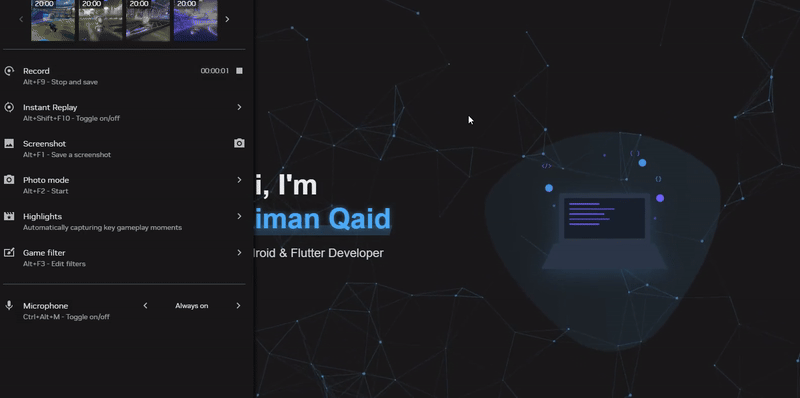
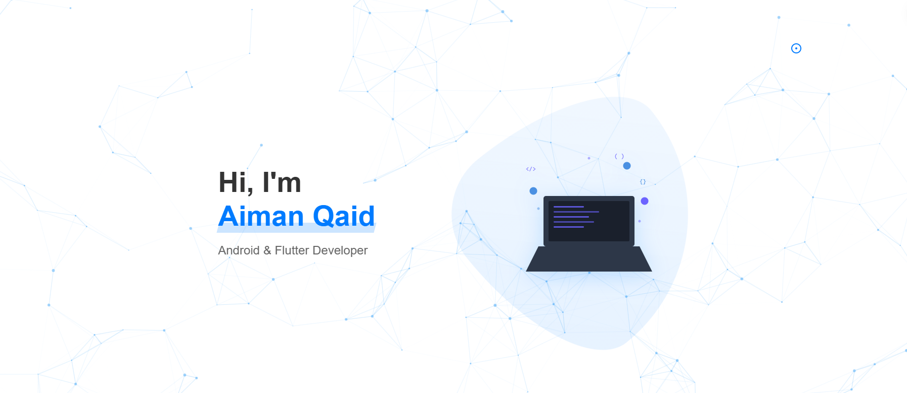
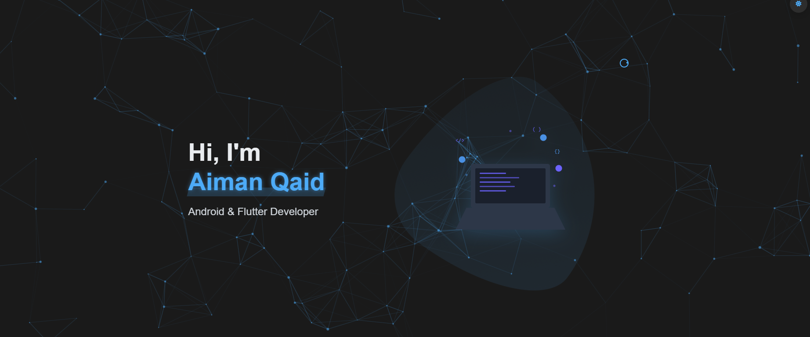

# My Portfolio Website

A modern, responsive portfolio website built with HTML, CSS, and JavaScript, featuring Firebase hosting and analytics integration.

## Live Demo

Visit the live website at: [https://aiman-qaid.web.app](https://aiman-qaid.web.app)

The website features both light and dark themes, allowing visitors to choose their preferred viewing experience:

| Light Theme | Dark Theme |
|------------|------------|
|  |  |

## Features

- Dark/Light theme toggle
- Responsive design for all devices
- Interactive UI with smooth animations
- Firebase Analytics integration
- Project showcase with live links
- Contact information and social media links

## Technologies Used

- HTML5
- CSS3
- JavaScript
- Firebase (Hosting & Analytics)
- Particles.js for background effects
- Font Awesome for icons

## Setup

1. Clone the repository
2. Install Firebase CLI: `npm install -g firebase-tools`
3. Login to Firebase: `firebase login`
4. Initialize Firebase: `firebase init`
5. Deploy: `firebase deploy`

## Analytics

The website includes Firebase Analytics to track:
- Page views
- Menu interactions
- Project views
- Contact clicks
- Social media interactions
- Theme changes

## License

MIT License
